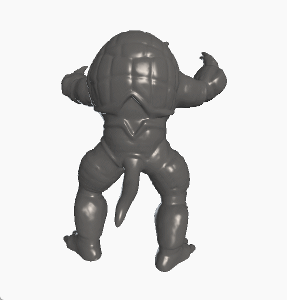
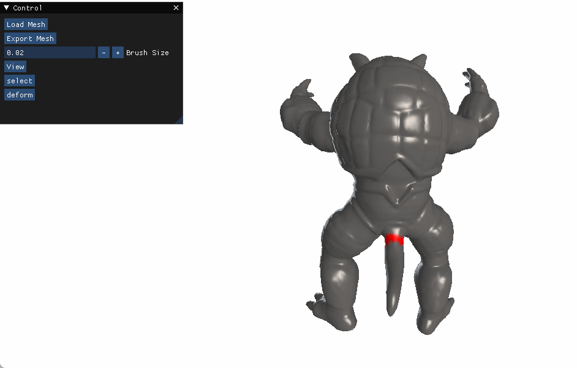
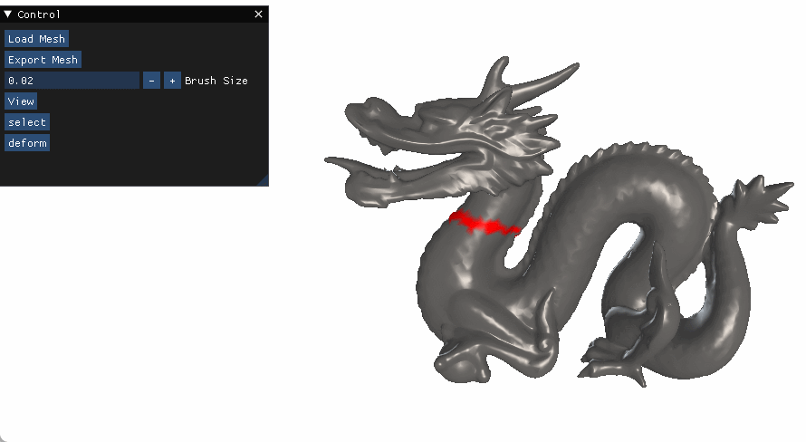
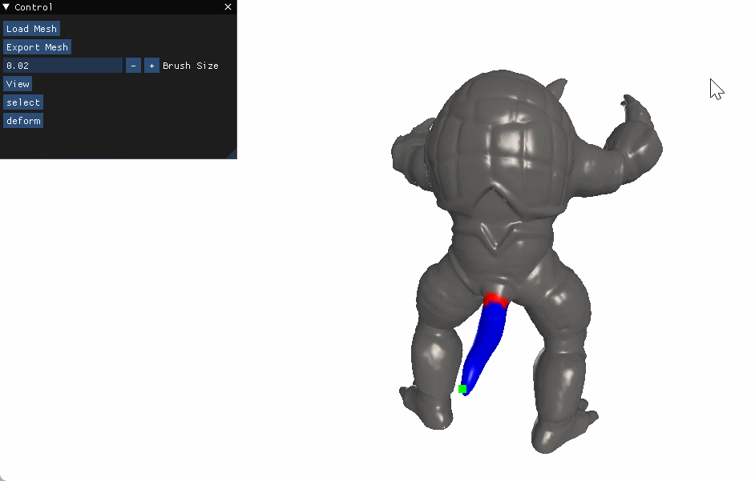
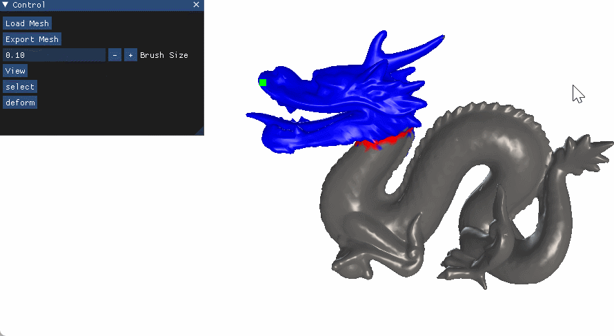

# 网格变形项目报告
本项目实现了一个简单网格变形算法，即基于测地形距离的变形传播。此外，本项目提供了一个直观的交互页面，使得用户能够较为容易地完成网格的变形操作，并导出变形后的结果。

## 代码使用

### 网格导入
运行`python main.py`，点击控制面板上的`load mesh`按钮，选择需要变形的mesh。在之后的操作过程中，始终可以使用鼠标左键旋转相机视角，使用鼠标滚轮放大或缩小网格。

### 固定区域选择

在默认的view模式下，可以使用鼠标**右键**按住并移动，使用刷子选取固定区域，可在左侧控制面板上选取刷子大小。

### 变形区域选择

首先，在左侧的控制面板中点击select，进入select模式。鼠标左键点击mesh上的点选择handler。之后程序会自动计算变形区域。对于拓扑结构比较复杂的物体，变形区域的计算可能不够准确，可以在select模式下，按照鼠标**右键**使用刷子增加变形区域范围。

通常情况下，对于拓扑结构简单的物体，能够准确地自动选择变形区域：

对于拓扑结构复杂的物体，可以在自动选择的基础上手动用刷子修改：

### 拖动handler以实现变形

在左侧的控制面板中点击deform，进入deform模式。鼠标**右键**拖动handler实现物体变形。

由于我们使用的是简单的变形传播算法，变形时物体的细节可能会损失。

### 导出网格
点击Export Mesh按钮即可导出变形后的网格。

## 实现方法

### 变形传播算法
变形传播算法的公式为
$\mathbf{p}_i^{\prime}=s(\mathbf{p}_i)\mathbf{T}(\mathbf{p}_i)+(1-s(\mathbf{p}_i))\mathbf{p}_i$，其中
$s(\mathbf{p})$为插值系数，可通过公式$\frac{\mathrm{dist}_{\mathcal{F}}(\mathbf{p})}{\mathrm{dist}_{\mathcal{F}}(\mathbf{p})+\mathrm{dist}_{\mathcal{H}}(\mathbf{p})}$得到。

在公式中，$\mathbf{p}_i^{\prime}$为变形后顶点的位置，$\mathbf{T}(\mathbf{p}_i)$为handler的偏移量。$\mathrm{dist}_{\mathcal{F}}$，$\mathrm{dist}_{\mathcal{H}}分别为$为$\mathbf{p}_i$到固定区域和handler的距离，在本项目中为测地线距离。

### 测地形距离计算
为简便起见，本项目将网格看成一个由顶点相连的图，边的权重为这条边在欧式空间中的长度，在图上计算两个点的图距离作为测地线距离的近似。

此外，我们对测地线距离的计算进行了效率的优化。为了计算固定区域到网格上每个点的测地线距离，我们在图上添加一个虚拟源点，并在虚拟源点和固定区域中的每个点之间连一条长度为0的边。这样问题就转化为了计算虚拟源点到每个点的距离，而这可以通过经典算法（如Dijkstra算法）快速解决。相较于单独计算固定区域中的每个点到网格上所有点的距离（时间复杂度为$O(|D||V|)$，经过优化后的时间复杂度降低为了$O(|V|)$。这使得handler拖动操作变得很流畅。

### 可变形区域估计
变形区域可以理解为handler与固定区域所围成的部分。在本项目中，一个点$\mathbf{p}$被认为在可变形区域中，当且仅当如下条件成立：

$$
\mathrm{dist}(\mathbf{h},\mathbf{p}) \le \mathrm{dist}(\mathbf{h},\mathbf{f})
$$
其中$\mathbf{f}=\mathrm{argmin}_{\mathbf{f} \in \mathcal{F}}\mathrm{dist}(\mathbf{p},\mathbf{f})$，即在固定区域中到$\mathbf{p}$最近的点。

在公式中，$\mathrm{dist}$表示两个点的测地线距离。注意到$\mathrm{dist}(\mathbf{h},\mathbf{p})$和$\mathbf{f}$都可通过Dijkstra算法得出。因此，计算可变形区域的时间复杂度仍为$O(|V|)$

### 刷子功能实现
为实现固定区域和可变形区域的选择，我们需要实现刷子功能。在本项目中，刷子功能的具体实现如下：首先计算出鼠标所代表的光线与网格的第一个交点，再将交点附近距离小于刷子大小的点选中，即完成刷子功能。

## 效果分析
在代码使用章节中，已经展示了我们的变形方法的具体效果。可以看出，由于我们使用的是简单的变形传播算法，可以做到非常实时地完成网格变形，但容易造成变形时的细节丢失。（如对龙头变形时，龙头上的花纹特征没有保持）